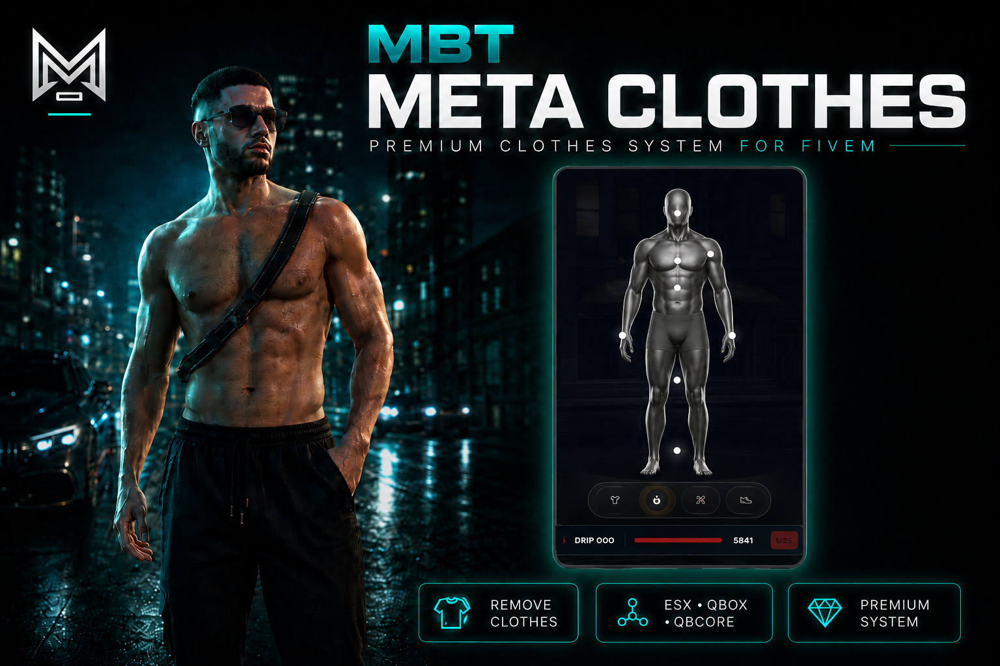
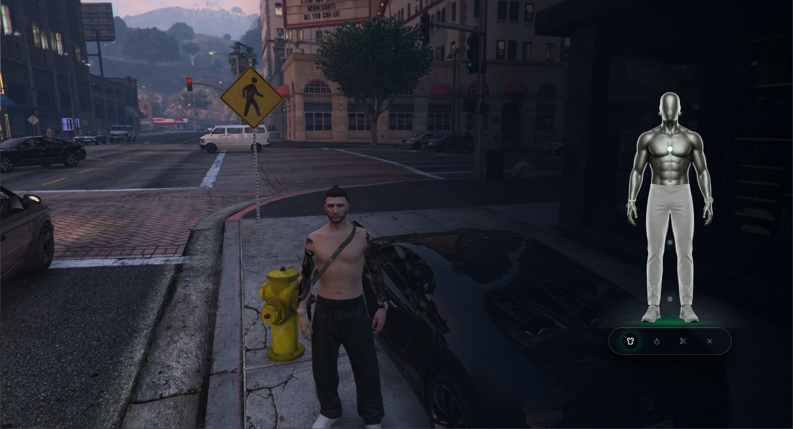

# MBT Meta Clothes — Clothing as Inventory Items for FiveM

<p align="center">
  
  
  
  
  
  
</p>

<p align="center">
  
</p>

<p align="center"><strong>Take your clothes off, and they become real items in your inventory.</strong></p>

Players undress through an interactive mannequin, hand garments to each other, get robbed of them, and find everything exactly where they left it after a relog. Free, for any ESX, QBCore, QBox, or OX Core server.

---

## Preview

<p align="center">
  
</p>

<p align="center"><em>The menu open in game — the mannequin mirrors what the player is actually wearing.</em></p>

---

## What players get

- **Every garment is an inventory item.** Take off a jacket and it lands in your inventory, with its exact model, texture and colour. Give it away, sell it, lose it in a fight.
- **An interactive mannequin**, not a wall of dropdowns. Click the part of the body you want to change.
- **Tops stay coherent.** Shirts, undershirts and torso variants move together, so nobody ends up half-dressed by accident.
- **Rob other players** of what they are wearing — one garment or the whole outfit — when they are down, ragdolled, or have their hands up.
- **Outfits earn reputation.** Wear good clothes and your drip level rises over time.
- **Clothes remember who wore them**, which gives investigative roleplay something to work with.
- **Keybind or commands.** `J` to open the menu, or `/shirt`, `/hat`, `/shoes` for quick changes.

---

## What server owners get

- **Players cannot duplicate clothes.** The server decides what you are wearing and hands back only that. A faked event gets nothing.
- **A cheater cannot rob someone who is not robbable**, cannot rob from across the map, and cannot reach into an apartment or a private instance from outside it.
- **A modified item cannot turn into a different item**, and cannot break the drip economy with impossible values.
- **Nothing is lost when the connection stutters.** Every change is confirmed, and a late or out-of-order message from a client is rejected rather than merged.
- **A broken config stops the resource** with a clear error, instead of running half-working until someone notices.
- **It gets along with your appearance script.** illenium-appearance, skinchanger, qb-clothing and others apply first; we correct within a single frame. If a player logged out without a shirt, they come back without a shirt — and nobody sees a flash of the wrong outfit.
- **It works with any multicharacter script**, because it listens to the framework's own events instead of a hardcoded list of resources.
- **English and Italian included**, and adding a language is one file.

---

## Requirements

| Requirement | Notes |
| --- | --- |
| **oxmysql** | Required |
| **One framework** | `es_extended`, `qb-core`, `qbx_core`, or `ox_core` |
| **One inventory** | `ox_inventory`, `qb-inventory`, or a custom adapter |
| **A target script** | Optional — `ox_target`, `qb-target`, or `qtarget`, auto-detected. Without one, theft runs off the `/steal` command |
| **A notification resource** | Optional — pick a preset in `config.lua`, or leave notifications silent |

Exactly one supported framework and one inventory must be active. Startup validation rejects missing, ambiguous, or incompatible combinations with an explicit error.

---

## Installation

1. Download the latest release and extract it into your `resources` folder.
2. Add the item definitions to your inventory — see [Installation and operations](docs/installation.md).
3. Start the resource **after** your framework and inventory:

```cfg
ensure es_extended      # or qb-core / qbx_core / ox_core
ensure ox_inventory     # or qb-inventory
ensure mbt_meta_clothes
```

4. Open `config.lua` and check `MBT.Drawables` and `MBT.Props` against the clothing pack your server uses.
5. Set `MBT.Debug = false` once you have verified the resource runs correctly.

Full dependency, database, build, and upgrade instructions: [docs/installation.md](docs/installation.md).

---

## Configuration

Everything lives in `config.lua`. The options you will actually touch:

### General

| Option | Default | Description |
| --- | --- | --- |
| `MBT.Debug` | `true` | Debug logging. **Set to `false` in production.** |
| `MBT.Language` | `'en'` | `'en'`, `'it'`, or your own file in `locales/` |
| `MBT.MenuKey` | `'J'` | Keybind to open the menu |
| `MBT.Theme.Accent` | `'00e676'` | UI accent colour, hex **without** `#` |
| `MBT.ActionCooldown` | `1500` | ms between actions, prevents animation spam |

### Theft

| Option | Default | Description |
| --- | --- | --- |
| `MBT.StealEnabled` | `true` | Clothing theft on or off — covers the target option and `/steal` alike |
| `MBT.StealDistance` | `5.0` | Max distance in metres |
| `MBT.StealDuration` | `1500` | Progress bar for a single garment |
| `MBT.StealAllDuration` | `2500` | Progress bar for stealing everything |
| `MBT.VictimAnimCap` | `10000` | ms cap on victim animation, anti-grief |
| `MBT.HandsUpAnims` | *(list)* | Which animations mark a player as robbable |

### Drip and DNA

| Option | Default | Description |
| --- | --- | --- |
| `MBT.DripEnabled` | `true` | Enable reputation from outfits |
| `MBT.DripInterval` | `300` | Seconds between XP ticks |
| `MBT.DripLevels` | *(list)* | Named levels and their thresholds |
| `MBT.DripSlotWeights` | *(table)* | Points per slot — a jacket can outweigh an earring |
| `MBT.DnaEnabled` | `true` | Track who wore each item |
| `MBT.DnaMaxEntries` | `3` | How many previous owners a garment remembers |
| `MBT.DnaExpiryHours` | `48` | Hours before that memory fades |

### Integration points

`MBT.ProgressBar` and `MBT.Notification` are plain Lua functions you can replace with your own. Every notification preset — `ox_lib`, the native GTA feed, ESX, QBCore — ships commented out: uncomment the one your server actually runs. Until you do, notifications are silent. The resource needs none of them to work.

---

## Commands

| Command | Description |
| --- | --- |
| `/shirt`, `/jacket` | Toggle the torso kit |
| `/trousers`, `/shoes`, `/chain` | Toggle individual garments |
| `/hat`, `/glasses`, `/ears`, `/watch` | Toggle accessories |
| `/hair` | Toggle hair |
| `/tuck <slot>` | Cycle a slot's configured clothing states |
| `/steal` | Open the theft menu on the nearest eligible player |
| `/drip` | Show your current drip level and XP |

---

## Under the hood

For anyone reading the code before trusting it on their server.

- **Server-authoritative state.** Returned items are derived from the server's own record of what a player is wearing. The client's item name, slot, and drawable are never trusted.
- **Acknowledged snapshot protocol.** Every mutation carries a session and a revision, and is confirmed. Stale or out-of-order client writes are rejected, not merged.
- **Theft is validated twice** — on begin and on complete — with a token, a minimum duration, and a grace window. Proximity checks routing bucket as well as distance. Eligibility comes from the victim's own replicated state, which a thief cannot forge.
- **Per-event rate limiting** on every inbound network event.
- **Metadata sanitised on the way in.** Item metadata can select among the names configured for that exact slot, and nothing else; numeric values are bounded and checked for `NaN` and infinity.
- **Configuration validated at boot**, stopping the resource on an invalid config.
- **106 self-test cases** across 8 suites, runnable from the server console.

---

## FAQ

**Does it work with my multicharacter script?**
It hooks into the standard framework lifecycle events rather than any specific multicharacter resource, so it works with `esx_multicharacter`, `qb_multicharacter`, and anything else that fires them.

**Will it fight with my appearance script?**
No. Appearance scripts apply first and we correct afterwards, within a single frame.

**Can players duplicate clothing?**
No. The server hands back only what its own records say the player was wearing.

**I use a custom inventory.**
Implement `MBT.CustomInventory` in `config.lua`. Startup validation will tell you if the signature is wrong.

---

## Credits

Developed by the **Malibu Tech Team**.

### Gianmarco — *DarkSideofTheCode*

MalibuTech was founded with my brother Gianmarco. He was the scripter — most of what carries the `mbt_` name is his, and so were the ideas, and the pace. I helped him keep it standing.

Meta Clothes started with him, in December 2022. He isn't here for this one.

The code has been rewritten many times since. The shape of it is still his.

`DarkSideofTheCode` was his name in the FiveM community. It stays on his work.

---

Thanks to the FiveM community for continuous feedback and testing.

---

## Links

- 📖 **Documentation:** [malibutechteam.com/docs](https://malibutechteam.com/docs/mbt-meta-clothes/overview)
- 📦 **MBT Meta Clothes on MalibuTech:** [malibutechteam.com](https://malibutechteam.com/scripts/5655569)
- 💬 **Support & updates:** [MalibuTech Discord](https://discord.gg/6scYba9AMy)

---
## License

This project is licensed under the [PolyForm Noncommercial License 1.0.0](LICENSE.md).

You are free to use and modify this software for **noncommercial purposes only** — personal use, hobby servers, research, and education. Any commercial use, redistribution for profit, or inclusion in paid products is prohibited without written permission from Malibu Tech Team.

---

## Media

- [Showcase](https://www.youtube.com/watch?v=TSCrxiJaWdg)
- [Cfx.re release](https://forum.cfx.re/t/free-esx-qb-ox-mbt-meta-clothes/4961827)

Copyright 2022-2026 MalibuTech.
